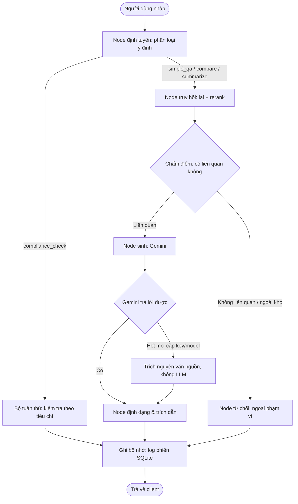

# DocuMind AI ⚖️

> **Nền tảng RAG tác tử & kiểm tra tuân thủ tự động cho pháp luật lao động và bảo hiểm xã hội Việt Nam**  
> *Dự án portfolio AI mức production — hồ sơ năng lực Senior / Staff AI Engineer*

[](https://python.org)
[](https://fastapi.tiangolo.com)
[](https://langchain-ai.github.io/langgraph/)
[](https://www.trychroma.com)
[](https://react.dev)
[](https://vitejs.dev)
[-brightgreen.svg)](tests/)
[](LICENSE)

---

## 🌟 Tổng quan

**DocuMind AI** trả lời câu hỏi về **pháp luật lao động và bảo hiểm xã hội Việt Nam** — Bộ luật Lao động, Luật Bảo hiểm xã hội, Luật Việc làm cùng các nghị định, thông tư hướng dẫn. Hệ thống trả lời kèm trích dẫn tới từng điều khoản, từ chối câu hỏi nằm ngoài kho tài liệu đã nạp, và kiểm tra tình huống lao động cụ thể (trần làm thêm giờ, thời gian thử việc, lương tối thiểu) đối chiếu với ngưỡng luật định bằng logic tất định.

Kho tài liệu gồm **20 văn bản / 1.146 chunk**, đánh chỉ mục tới cấp `Điều`/`Khoản` kèm mốc hiệu lực, nên cùng một câu hỏi có thể tra *tại một thời điểm* cho trước và được trả lời theo bản còn hiệu lực khi đó — nhiều văn bản trong số này đã bị sửa đổi, thay thế (lương tối thiểu, Luật BHXH 2024, Luật Việc làm 2025).

### Năng lực chính

1. **Luồng tác tử dạng máy trạng thái (LangGraph)**:
   - Định tuyến ý định động (`simple_qa`, `compare`, `summarize`, `compliance_check`).
   - Giữ trạng thái nhiều lượt hội thoại một cách tất định, có bộ nhớ phiên.
2. **Truy hồi lai hai pha + rerank bằng mạng nơ-ron**:
   - **Truy hồi thưa (sparse)**: Okapi BM25 để khớp chính xác thuật ngữ luật (ví dụ *"Điều 14 Thông tư 18/2024"*).
   - **Truy hồi dày (dense)**: `gemini-embedding-001` (3072 chiều, gọi qua API — không nạp model vào RAM) để hiểu câu hỏi diễn đạt lại theo ngữ nghĩa.
   - **Hợp nhất & rerank**: gộp bằng Reciprocal Rank Fusion (RRF) lấy top-20, chấm điểm lại bằng cross-encoder (`BAAI/bge-reranker-v2-m3`) để chọn top-8 chunk có độ chính xác cao nhất.
3. **Bộ kiểm tra tuân thủ tự động (`compliance_check`)**:
   - Trích tham số bằng regex kết hợp LLM cho các ngưỡng kiểm tra định lượng.
   - Kết luận đạt/không đạt có thể kiểm chứng, đối chiếu ngưỡng luật định đã được tuyển chọn thủ công:
     - **Trần làm thêm giờ**: $\le 200$ giờ/năm và $\le 40$ giờ/tháng (Điều 107, Bộ luật Lao động 45/2019/QH14).
     - **Thời gian thử việc**: $\le 60$ ngày với công việc cần trình độ cao đẳng trở lên (Điều 25).
     - **Lương thử việc**: $\ge 85\%$ mức lương của công việc đó (Điều 26).
     - **Nghỉ hằng năm**: $\ge 12$ ngày làm việc trong điều kiện bình thường (Điều 113).
     - **Lương tối thiểu vùng I**: $\ge 5.310.000$ VNĐ/tháng (Điều 3, Nghị định 293/2025/NĐ-CP).
4. **Một nhà cung cấp LLM, chịu lỗi bằng vòng xoay khoá**:
   - **Gemini** lo cả embedding lẫn sinh câu trả lời — không còn nhà cung cấp nào khác.
   - Mỗi lời gọi xoay vòng qua các cặp (API key × model); hết mọi cặp thì trả lời bằng cách trích nguyên văn nguồn đã truy hồi, không bịa.
5. **Bám nguồn nghiêm ngặt, chống bịa đặt**:
   - Bắt buộc trích dẫn nội dòng `[N]` chỉ rõ điều, số hiệu văn bản và cơ quan ban hành.
   - Từ chối có cơ sở: tự kiểm tra ranh giới phạm vi và từ chối khi câu hỏi không có tài liệu chống lưng.
6. **Trải nghiệm full-stack hiện đại**:
   - Giao diện React/Vite nền tối, có streaming qua WebSocket, ngăn trích dẫn tương tác, khu thử nghiệm kiểm tra tuân thủ và trình duyệt tài liệu.

---

## 🏛️ Kiến trúc hệ thống

### 1. Đường đi của một request

```
Câu hỏi người dùng (HTTP / WebSocket)
     │
     ▼
┌─────────────────────────────────────────────────────────────────────────┐
│  [1] Cổng FastAPI                                                       │
│      Giới hạn 10 request/phút · CORS allowlist · nén GZip               │
└────────────────────────────────────┬────────────────────────────────────┘
                                     │
                                     ▼
┌─────────────────────────────────────────────────────────────────────────┐
│  [2] Node định tuyến ý định (LangGraph)                                 │
│      LLM phân loại (temp=0) → simple_qa │ compare │ summarize           │
│                                         │ compliance_check              │
└────────────────────────────────────┬────────────────────────────────────┘
                                     │
         ┌───────────────────────────┴───────────────────────────┐
         ▼                                                       ▼
┌───────────────────────────────────┐   ┌─────────────────────────────────┐
│  [3A] Pipeline truy hồi lai       │   │  [3B] Bộ kiểm tra tuân thủ      │
│  ┌───────────────┐ ┌────────────┐ │   │  • Trích tham số regex/LLM      │
│  │ Okapi BM25    │ │ Vector dày │ │   │  • Đối chiếu ngưỡng luật định   │
│  │ (khớp từ khoá)│ │ (VN-Embed) │ │   │    (vd: làm thêm <= 200h/năm)   │
│  └──────┬────────┘ └─────┬──────┘ │   │  • Trích dẫn đã được kiểm chứng │
│         └─────── RRF ────┘        │   │    (đạt / không đạt / thiếu dữ  │
│         Nhóm ứng viên: top-20     │   │     liệu)                       │
│                 │                 │   └────────────────┬────────────────┘
│                 ▼                 │                    │
│  ┌──────────────────────────────┐ │                    │
│  │ Rerank bằng cross-encoder    │ │                    │
│  │ BAAI/bge-reranker-v2-m3      │ │                    │
│  │ Chọn: top-8 chính xác nhất   │ │                    │
│  └──────────────┬───────────────┘ │                    │
└─────────────────┼─────────────────┘                    │
                  ▼                                      │
┌──────────────────────────────────────────────────┐     │
│  [4] Node sinh câu trả lời + kiểm trích dẫn      │     │
│      Gemini (xoay vòng key × model)              │     │
│      Hết cặp → trích nguyên văn nguồn, không LLM │     │
│      Prompt bám nguồn: bắt buộc trích dẫn [N]    │     │
└─────────────────┬────────────────────────────────┘     │
                  │                                      │
                  └──────────────────┬───────────────────┘
                                     ▼
┌─────────────────────────────────────────────────────────────────────────┐
│  [5] Tầng trả kết quả & streaming                                       │
│      WebSocket bất đồng bộ (từng token) hoặc REST trả JSON              │
└─────────────────────────────────────────────────────────────────────────┘
```

### 2. Máy trạng thái LangGraph



---

## 📚 Kho văn bản lao động & bảo hiểm xã hội

20 văn bản chính thức (~1.146 chunk) được cắt bằng bộ chunker pháp lý riêng
(`src/ingestion/chunker.py`) đúng ranh giới `Điều` / `Khoản`, mỗi chunk mang theo mốc hiệu lực
của phiên bản nó thuộc về. File nguồn: [`data/raw/lao_dong/`](data/raw/lao_dong/).

| Nhóm | Văn bản tiêu biểu | Nội dung chính |
|---|---|---|
| **Lao động** | `45/2019/QH14` (Bộ luật Lao động), `18/VBHN-VPQH`, `145/2020/NĐ-CP`, `10/2020/TT-BLĐTBXH` | Hợp đồng lao động, thử việc, tiền lương, thời giờ làm việc & làm thêm giờ, kỷ luật lao động, chấm dứt hợp đồng. |
| **Tiền lương tối thiểu** | `293/2025/NĐ-CP` (hiệu lực 01/01/2026), `74/2024/NĐ-CP` | Mức lương tối thiểu tháng/giờ theo 4 vùng — hai phiên bản cùng tồn tại trong index để tra cứu theo thời điểm. |
| **Bảo hiểm xã hội** | `41/2024/QH15` (Luật BHXH 2024), `58/2014/QH13`, `158/2025/NĐ-CP`, `159/2025/NĐ-CP`, `115/2015/NĐ-CP`, `134/2015/NĐ-CP`, `59/2015/TT-BLĐTBXH`, `11–12/2025/TT-BNV` | BHXH bắt buộc & tự nguyện, chế độ ốm đau, thai sản, hưu trí, tử tuất. |
| **Việc làm & BHTN** | `74/2025/QH15` (Luật Việc làm 2025), `38/2013/QH13`, `374/2025/NĐ-CP`, `28/2015/NĐ-CP` | Bảo hiểm thất nghiệp, trợ cấp thất nghiệp, hỗ trợ học nghề, dịch vụ việc làm. |
| **Hưu trí & khác** | `135/2020/NĐ-CP`, `293/2025/NĐ-CP` | Lộ trình tuổi nghỉ hưu, điều kiện nghỉ hưu sớm. |

Một số văn bản thay thế lẫn nhau (Luật BHXH 2024 thay bản 2014, Luật Việc làm 2025 thay bản
2013, NĐ 293/2025 thay NĐ 74/2024). Cả hai phiên bản đều nằm trong index — đó là điều khiến
việc tra cứu theo `as_of_date` có ý nghĩa thật chứ không phải để trang trí.

---


## ⚖️ Bộ kiểm tra tuân thủ tự động

Khác với các hệ RAG thông thường chỉ dựa vào sinh văn bản theo xác suất, DocuMind AI có thêm
một **bộ kiểm tra tuân thủ lai giữa tất định và ký hiệu**:

```python
# Kết quả thật — src/rag/compliance.py, tiêu chí trong data/compliance/criteria.json
from src.rag.compliance import check_compliance

# Trường hợp 1: trần làm thêm giờ trong năm
check_compliance("Công ty cho làm thêm 250 giờ trong 01 năm có đúng luật không?")
# {
#   "matched": True,
#   "criterion_id": "lam_them_gio_trong_nam",
#   "verdict": "fail",
#   "extracted_value": 250.0,
#   "explanation": "Số giờ làm thêm vượt trần 200 giờ trong 01 năm theo Điều 107 khoản 2
#                   điểm c Bộ luật Lao động 45/2019/QH14. Chỉ các ngành, nghề thuộc khoản 3
#                   Điều 107 mới được làm thêm đến 300 giờ/năm.",
#   "citation": {"so_hieu": "Bộ luật Lao động 45/2019/QH14",
#                "dieu_khoan": "Điều 107 khoản 2 điểm c"}
# }

# Trường hợp 2: lương tối thiểu vùng I — "4.500.000 đồng" được chuẩn hoá về 4,5 triệu trước khi so sánh
check_compliance("Công ty trả lương 4.500.000 đồng/tháng ở vùng I có đúng luật không?")
# verdict = "fail" (thấp hơn 5.310.000 đồng/tháng — Điều 3 khoản 1 Nghị định 293/2025/NĐ-CP)

# Ngoài phạm vi → không bịa ra kết luận
check_compliance("Giá vàng SJC hôm nay bao nhiêu?")   # verdict = "no_match"
```

---

## 📊 Đánh giá

Bộ khung đánh giá ([`eval/`](eval/)) chạy ablation truy hồi trên 4 chiến lược
(BM25 · dense · hybrid+RRF · hybrid+reranker) cùng các chỉ số sinh văn bản của RAGAS, đối chiếu
với bộ câu hỏi tự xây có sẵn đáp án chuẩn và id chunk nguồn.

### Kết quả trên kho lao động/BHXH hiện tại (đo 2026-09-23)

Gold set [`data/eval/legal_qa_200.json`](data/eval/legal_qa_200.json): **199 câu**, 11 loại
(tra một điều khoản, đổi phiên bản văn bản, ghép nhiều điều khoản, tiền đề sai, ngoài phạm
vi, trước mốc phủ corpus…). Mỗi câu trỏ tới `clause_uid` nguồn;
[`eval/validate_gold.py`](eval/validate_gold.py) kiểm tra trên index thật rằng đáp án có
**nguyên văn** trong chunk nguồn và `as_of_date` nằm trong hiệu lực của chunk đó (199/199 đạt).

Cấu hình đo = cấu hình production (Render: hybrid BM25 + dense, RRF, **không reranker**).
"Trước" = truy hồi thường; "sau" = điều kiện hiệu lực `as_of_date` đẩy xuống vector store
([DEC-0003](docs/decisions/DEC-0003-retrieval-context-acl-tenant.md)).

| Chỉ số | Trước (`no_temporal`) | Sau (`pre_filter`) |
|---|---:|---:|
| Recall@1 | 0.500 | **0.667** |
| Recall@5 | 0.903 | **0.935** |
| MRR | 0.671 | **0.779** |
| Ngữ cảnh lẫn bản luật hết hiệu lực | 21.6% | **0.0%** |
| Answer accuracy (169 câu cả hai arm đều gọi được LLM) | 0.763 | **0.935** |
| — riêng câu đổi phiên bản văn bản (n=28) | 0.36 | **1.00** |
| Faithfulness (LLM judge, n≈160) | 0.975 | 0.957 |
| Latency truy hồi p95 | 555 ms | 672 ms |
| Latency end-to-end p50 / p95 | 4.6 s / 22.8 s | 4.6 s / 19.0 s |

Đọc bảng cho đúng:
- **p95 end-to-end bị chi phối bởi quota free tier Gemini**, không phải thời gian sinh: lượt
  đo gặp hàng trăm lần 429, xoay key/model rồi chờ; ~25 câu/arm rơi xuống chế độ trích
  nguyên văn (không LLM). Vì thế accuracy được so trên tập 169 câu cả hai arm đều do Gemini trả lời.
- Faithfulness giảm nhẹ ở arm "sau" — chưa đủ mẫu để kết luận khác biệt; ghi đúng như đo.
- Câu do Claude soạn (`drafted_by: claude`, `reviewed: false`) **chưa được người duyệt**.

Tái lập (mỗi lần chạy là một run trong MLflow, experiment `documind-eval`, kèm git sha + cấu hình):

```powershell
# Truy hồi — không gọi LLM
python eval/temporal_eval.py --gold data/eval/legal_qa_200.json --retrieval-only `
  --arms no_temporal temporal_filter pre_filter --mlflow retrieval
# End-to-end + faithfulness judge
python eval/temporal_eval.py --gold data/eval/legal_qa_200.json `
  --arms no_temporal pre_filter --judge no_temporal pre_filter --mlflow e2e
mlflow ui   # http://localhost:5000 — so sánh run
```

CI ([`.github/workflows/ci.yml`](.github/workflows/ci.yml)) chạy retrieval eval trên Qdrant
Cloud ở mỗi PR và **fail PR** nếu recall/MRR tụt quá ngưỡng so với
[`reports/eval_baseline.json`](reports/eval_baseline.json) ([`eval/ci_gate.py`](eval/ci_gate.py)).

### So sánh vector store: Qdrant Cloud vs Chroma Cloud (đo 2026-09-23)

[`eval/provider_bench.py`](eval/provider_bench.py) đo **riêng tầng vector store**: cùng 1151
vector (copy từ Chroma local, không re-embed — script kiểm tập id khớp trước khi đo), cùng
query embedding (cache), cùng filter `RetrievalContext` (tenant/ACL/`as_of_date`). BM25,
reranker, LLM giống nhau ở hai bên nên không đưa vào. "Exact" = cosine vét cạn numpy với cùng
predicate filter — mốc để đo sai số của index ANN. 199 câu × 3 lần lặp, hai provider chạy xen
kẽ từng query theo thứ tự ngẫu nhiên; latency đo từ máy dev ở Việt Nam, **gồm mạng**.

| Chỉ số (top-10, có filter) | Exact | Qdrant Cloud | Chroma Cloud |
|---|---:|---:|---:|
| ANN recall@10 so với exact | 1.000 | **1.000** | 0.998 (3/199 câu lệch) |
| Recall@1 / @5 · MRR (dense, gold clause) | 0.667 / 0.962 · 0.794 | 0.667 / 0.962 · 0.794 | 0.667 / 0.962 · 0.794 |
| Kết quả vi phạm filter | — | 0% | 0% |
| Latency query p50 / p95 / p99 | — | **209 / 324 / 402 ms** | 309 / 1336 / 2380 ms |
| RTT mạng thuần p50 / p95 (healthcheck) | — | 193 / 197 ms | 260 / 734 ms |
| Tải toàn corpus (dựng BM25) | — | 7.1 s | 4.2 s |

Đọc bảng cho đúng:
- **Chất lượng truy hồi như nhau**: recall/MRR trùng khít; Chroma Cloud lệch exact ở 3 câu
  nhưng không đổi rank của gold clause. Filter đẩy xuống đúng 100% ở cả hai.
- **Chênh latency phần lớn là mạng**, không phải engine: Qdrant ở GCP Sydney
  (`australia-southeast1`), Chroma Cloud trả IP dải AWS (34.200.x, nhiều khả năng us-east).
  Trừ RTT, phần xử lý phía server ≈ 15 ms (Qdrant) vs ≈ 50 ms (Chroma). Đuôi p95/p99 của Chroma
  đến từ jitter mạng — chính healthcheck đã có p95 734 ms. Kết quả sẽ khác nếu đo từ Render.
- Qdrant cần payload index cho mọi field filter (strict mode, xem `ensure_qdrant_payload_indexes`);
  Chroma Cloud không cần, nhưng client `chromadb` 0.6.3 của dự án **không nói chuyện được** với
  Chroma Cloud (server 1.x) — benchmark và [`scripts/copy_chroma_to_cloud.py`](scripts/copy_chroma_to_cloud.py)
  gọi REST v2 qua [`src/rag/chroma_cloud.py`](src/rag/chroma_cloud.py). App production vẫn đọc Qdrant.

Báo cáo đầy đủ (thiết kế phép đo, 3 câu lệch, giới hạn): [`reports/provider_bench.md`](reports/provider_bench.md).

```powershell
python scripts/copy_chroma_to_cloud.py            # đồng bộ Chroma Cloud mỗi khi corpus đổi
python eval/provider_bench.py --repeat 3 --mlflow provider-bench   # experiment documind-provider-bench
```

**Benchmark lịch sử (kho tài liệu trước đây).** Phương pháp luận và các phát hiện kỹ thuật vẫn
giữ nguyên giá trị — xem [`EVALUATION.md`](EVALUATION.md). Trên bộ 110 câu hỏi tự xây (lĩnh vực
cũ: quy chế đào tạo đại học): hybrid+reranker đạt **hit_rate@K 0,95, MRR 0,87, tỉ lệ từ chối câu
ngoài kho 100%**; RAGAS faithfulness ≈ 0,9 (thử nghiệm 5 câu). Lần đánh giá đó cũng dẫn tới
những bản vá thật — reranker lệch ngôn ngữ (context_precision 0,66 → 0,83), lỗi thang điểm
khiến hệ thống từ chối nhầm, và ~15% câu bị từ chối thừa ở khâu sinh.

| Khâu | Cơ chế |
|---|---|
| Truy hồi thưa | Okapi BM25 — khớp chính xác thuật ngữ luật / số hiệu điều khoản |
| Truy hồi dày | `gemini-embedding-001` (3072 chiều, qua API) — khớp theo ngữ nghĩa |
| Hợp nhất | Reciprocal Rank Fusion trên cả hai danh sách ứng viên (top-20) |
| Rerank | Cross-encoder `BAAI/bge-reranker-v2-m3` → top-8 (local; production tắt — Render free 512MB RAM) |
| Rào chắn khi sinh | Từ chối câu ngoài kho · bắt buộc trích dẫn ở từng đoạn |

---

## 🛠️ Ngăn xếp công nghệ

| Tầng | Công nghệ | Lý do chọn |
|---|---|---|
| **Điều phối tác tử** | LangGraph 0.2 + LlamaIndex 0.14 | Chuyển trạng thái tường minh có kiểu, test đơn vị được từng node, định tuyến ý định tất định (không phụ thuộc LLM). |
| **LLM** | Google Gemini (các model flash-lite, khai trong `GEMINI_GENERATION_MODELS`) | Nhà cung cấp duy nhất: quota cộng dồn qua nhiều key, không cold-start, không cần GPU. Xoay vòng (key × model) thay cho fallback nhiều nhà cung cấp. |
| **Embedding** | `gemini-embedding-001` (3072 chiều, qua API) | Không nạp model nào vào RAM nên chạy được trên host 512MB; dùng chung key với phần sinh câu trả lời. |
| **Vector store** | ChromaDB (local persistent) / Qdrant | Backend cắm-rút qua `VECTOR_STORE_PROVIDER` mà không phải viết lại phần ingest hay truy vấn. |
| **Reranker** | `BAAI/bge-reranker-v2-m3` | Cross-encoder đa ngữ hàng đầu, xếp hạng điều khoản luật với độ chính xác cao. |
| **API backend** | FastAPI + WebSockets + Pydantic v2 | I/O bất đồng bộ hoàn toàn, streaming hai chiều, tự sinh schema OpenAPI. |
| **Giao diện** | React 19 + TypeScript + Vite | Console nền tối, ngăn xem trước nguồn, bảng thử nghiệm kiểm tra tuân thủ. |
| **Kiểm thử** | Pytest + Pytest-Cov + Pytest-Asyncio | 227/227 test pass (đã chạy offline) gồm unit, tích hợp và rào chắn. |

---

## 🚀 Bắt đầu nhanh

### Yêu cầu trước
- Đã cài Python 3.10 hoặc 3.11.
- Node.js 18+ (cho dev server của frontend).
- API key: `GOOGLE_API_KEY` (nên khai thêm `GOOGLE_API_KEY_2`, `GOOGLE_API_KEY_3` ở project khác để cộng dồn quota).

### 1. Dựng môi trường
Clone repo và cài phụ thuộc backend:
```powershell
git clone https://github.com/luongducthangDS/DocuMindAI.git
cd DocuMindAI

python -m venv .venv
.\.venv\Scripts\Activate.ps1
pip install -r requirements-dev.txt   # prod-only: requirements.txt
```

Tạo file `.env`:
```ini
GOOGLE_API_KEY=AIza_your_google_gemini_key_here
GOOGLE_API_KEY_2=
GOOGLE_API_KEY_3=
EMBEDDING_MODEL=gemini-embedding-001
VECTOR_STORE_PROVIDER=chroma
```

### 2. Nạp kho tài liệu
Đổ các văn bản pháp luật đã tuyển chọn vào vector database ChromaDB:
```powershell
python scripts/ingest_documents.py --source-dir data/raw/lao_dong `
  --manifest docs/corpus/corpus_manifest.yaml --reset
```

### 3. Chạy ứng dụng

#### Cách A: chạy một lệnh bằng PowerShell
```powershell
.\start.ps1
```
Lệnh này bật cả FastAPI ở `http://localhost:8081` lẫn frontend Vite ở `http://localhost:5174`.

#### Cách B: chạy thủ công
```powershell
# Terminal 1 — Backend
uvicorn src.api.main:app --host 0.0.0.0 --port 8081 --reload

# Terminal 2 — Frontend
cd frontend
npm install
npm run dev
```

Mở console web tại **`http://localhost:5174`**.  
Tài liệu API (Swagger) tương tác: **`http://localhost:8081/docs`**.

---

## 🧪 Kiểm thử & xác minh

Chạy toàn bộ test tự động:
```powershell
# Chạy tất cả test kèm báo cáo coverage
pytest -v

# Chạy riêng test đơn vị của bộ kiểm tra tuân thủ
pytest tests/test_compliance.py -v

# Chạy benchmark truy hồi (smoke test)
python eval/run_evals.py --strategies dense rerank --retrieval-only --limit 5
```

---

## 📐 Hồ sơ quyết định kiến trúc (ADR)

- **ADR-001: Chọn máy trạng thái LangGraph thay vì điều phối kiểu chain**:
  - *Bối cảnh*: tra cứu quy định đòi hỏi khôi phục lỗi tất định và nhánh rẽ kiểm toán được giữa hỏi đáp thông tin và kiểm tra tuân thủ.
  - *Quyết định*: dùng `StateGraph` của LangGraph với trạng thái có kiểu tường minh (`AgentState`).
  - *Kết quả*: test đơn vị được tới từng node và trace LangSmith đọc được rõ ràng.
- **ADR-002: Truy hồi lai hợp nhất bằng Reciprocal Rank Fusion (RRF)**:
  - *Bối cảnh*: câu hỏi người dùng dao động giữa ngôn ngữ tự nhiên (*"làm thêm bao nhiêu giờ một năm thì vượt luật"*) và tra cứu điều khoản chính xác (*"Khoản 2 Điều 107 Bộ luật Lao động"*).
  - *Quyết định*: chạy song song Okapi BM25 + truy hồi vector dày rồi hợp nhất bằng RRF trước khi rerank bằng cross-encoder.
  - *Kết quả*: một đường đi duy nhất phục vụ được cả tra cứu điều khoản chính xác lẫn câu hỏi diễn đạt tự do; reranker sau đó đẩy đúng điều khoản lên hạng 1. Số liệu ablation truy hồi: xem [`EVALUATION.md`](EVALUATION.md).
- **ADR-003: Một nhà cung cấp LLM, chịu lỗi bằng vòng xoay khoá**:
  - *Bối cảnh*: API LLM ở gói miễn phí thỉnh thoảng trả 429 vì giới hạn tần suất; nhưng nuôi nhiều nhà cung cấp cũng nhân lên số đường code phải kiểm thử và số cách hệ thống hỏng.
  - *Quyết định* (2026-09-19): chỉ dùng Gemini cho cả embedding lẫn sinh câu trả lời; chịu lỗi bằng cách xoay vòng qua các cặp (API key × model) thay vì chuyển sang nhà cung cấp khác. Đã gỡ Groq, endpoint tương thích OpenAI và mọi nhánh embedding local.
  - *Kết quả*: một đường code duy nhất cho mọi lời gọi LLM (`gemini_generate`); 429 được hấp thụ bằng cặp kế tiếp; hết mọi cặp thì trả lời bằng trích nguyên văn nguồn đã truy hồi thay vì im lặng hỏng.

---

## 📄 Giấy phép

Dự án phát hành theo giấy phép MIT — xem chi tiết tại file [LICENSE](LICENSE).
