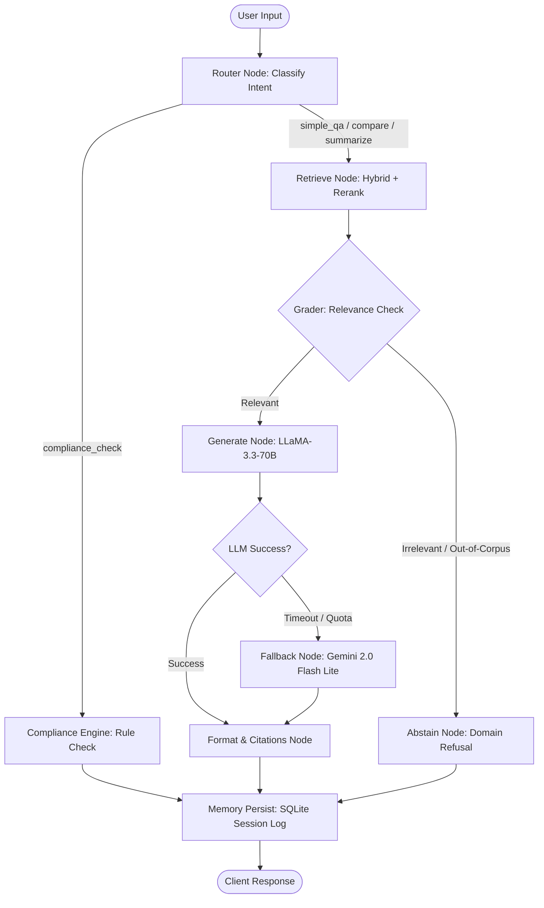

# DocuMind AI ⚖️

> **Agentic RAG & Automated Compliance Platform for Vietnamese Labour & Social-Insurance Law**  
> *Production-Grade AI Portfolio Project — Senior / Staff AI Engineer Showcase*

[](https://python.org)
[](https://fastapi.tiangolo.com)
[](https://langchain-ai.github.io/langgraph/)
[](https://www.trychroma.com)
[](https://react.dev)
[](https://vitejs.dev)
[-brightgreen.svg)](tests/)
[](LICENSE)

---

## 🌟 Executive Overview

**DocuMind AI** answers questions about Vietnamese **labour and social-insurance law** — the Labour Code, the Social Insurance Law, the Employment Law and the decrees and circulars that implement them. It gives clause-level cited answers, refuses questions outside the indexed corpus, and deterministically audits concrete workplace situations (overtime caps, probation terms, minimum wage) against the statutory thresholds.

The corpus is **20 documents / 1,146 chunks**, indexed down to `Điều`/`Khoản` with validity dates, so the same question can be asked *as of* a given date and answered from the version in force then — several of these documents have been amended (minimum wage, the 2024 Social Insurance Law, the 2025 Employment Law).

### Key Capabilities

1. **State-Machine Agentic Workflow (LangGraph)**:
   - Dynamic intent routing (`simple_qa`, `compare`, `summarize`, `compliance_check`).
   - Deterministic multi-turn state preservation and session memory.
2. **Dual-Pass Hybrid Retrieval & Neural Reranking**:
   - **Sparse Retrieval**: Okapi BM25 for exact statutory term matching (e.g., *"Điều 14 Thông tư 18/2024"*).
   - **Dense Retrieval**: `AITeamVN/Vietnamese_Embedding` (1024-dim) for semantic paraphrase understanding.
   - **Fusion & Reranking**: Reciprocal Rank Fusion (RRF) pool (top-20) re-scored by cross-encoder (`BAAI/bge-reranker-v2-m3`) to select the top-8 highest-precision chunks.
3. **Automated Statutory Compliance Engine (`compliance_check`)**:
   - Hybrid regex and LLM parameter extraction for quantifiable audit thresholds.
   - Verifiable pass/fail evaluations against curated statutory thresholds:
     - **Overtime cap**: $\le 200$ h/year and $\le 40$ h/month (Điều 107, Labour Code 45/2019/QH14).
     - **Probation period**: $\le 60$ days for roles requiring a college degree or above (Điều 25).
     - **Probation pay**: $\ge 85\%$ of the job's wage (Điều 26).
     - **Annual leave**: $\ge 12$ working days under normal conditions (Điều 113).
     - **Region I minimum wage**: $\ge 5,310,000$ VNĐ/month (Điều 3, Decree 293/2025/NĐ-CP).
4. **Resilient Multi-LLM Routing**:
   - **Primary**: Ultra-low latency Groq LLaMA-3.3-70B Versatile (~300 tokens/sec).
   - **Automatic Failover**: Google Gemini Flash Lite when rate limits, quotas, or timeouts occur.
5. **Strict Grounding & Hallucination Prevention**:
   - Compulsory inline statutory citations `[N]` referencing Article, Circular number, and issuing institution.
   - Confident abstention: automatic domain boundary check and refusal when queries lack documentary support.
6. **Modern Full-Stack Experience**:
   - Reactive Dark-Mode React/Vite interface featuring WebSocket streaming, interactive citation drawers, compliance testing sandbox, and document explorer.

---

## 🏛️ System Architecture

### 1. Request Pipeline

```
User Query (HTTP / WebSocket)
     │
     ▼
┌─────────────────────────────────────────────────────────────────────────┐
│  [1] FastAPI Gateway                                                    │
│      Rate limiting (10 req/min) · CORS allowlist · GZip compression     │
└────────────────────────────────────┬────────────────────────────────────┘
                                     │
                                     ▼
┌─────────────────────────────────────────────────────────────────────────┐
│  [2] LangGraph Intent Router Node                                       │
│      LLM Classification (temp=0) → simple_qa │ compare │ summarize      │
│                                    │ compliance_check                  │
└────────────────────────────────────┬────────────────────────────────────┘
                                     │
         ┌───────────────────────────┴───────────────────────────┐
         ▼                                                       ▼
┌───────────────────────────────────┐   ┌─────────────────────────────────┐
│  [3A] Hybrid Retrieval Pipeline   │   │  [3B] Compliance Engine         │
│  ┌──────────────┐ ┌─────────────┐ │   │  • Regex/LLM parameter extract  │
│  │ Okapi BM25   │ │ Dense Vector│ │   │  • Threshold condition evaluate │
│  │ (Exact Lexical)│ (VN-Embed) │ │   │    (e.g., OT <= 200h/năm)       │
│  └──────┬───────┘ └──────┬──────┘ │   │  • Verified statutory citation  │
│         └─────── RRF ────┘        │   │    (pass / fail / missing data) │
│            Pool: top-20           │   └────────────────┬────────────────┘
│                 │                 │                    │
│                 ▼                 │                    │
│  ┌──────────────────────────────┐ │                    │
│  │ Cross-Encoder Neural Rerank  │ │                    │
│  │ BAAI/bge-reranker-v2-m3      │ │                    │
│  │ Select: top-8 high-precision │ │                    │
│  └──────────────┬───────────────┘ │                    │
└─────────────────┼─────────────────┘                    │
                  ▼                                      │
┌──────────────────────────────────────────────────┐     │
│  [4] Generator Node + Citation Verification      │     │
│      Primary: Groq LLaMA-3.3-70B (~300 tok/s)    │     │
│      Fallback: Gemini 2.0 Flash Lite (auto)      │     │
│      Grounding prompt: mandatory [N] citation    │     │
└─────────────────┬────────────────────────────────┘     │
                  │                                      │
                  └──────────────────┬───────────────────┘
                                     ▼
┌─────────────────────────────────────────────────────────────────────────┐
│  [5] Delivery & Streaming Layer                                         │
│      Async WebSocket Generator (token-by-token) or REST JSON Response   │
└─────────────────────────────────────────────────────────────────────────┘
```

### 2. LangGraph State Machine Architecture



---

## 📚 Vietnamese Labour & Social-Insurance Corpus

20 official documents (~1,146 chunks) split by our legal chunker (`src/ingestion/chunker.py`)
at exact `Điều` (Article) / `Khoản` (Clause) boundaries, each chunk carrying the validity
dates of the version it belongs to. Source files: [`data/raw/lao_dong/`](data/raw/lao_dong/).

| Nhóm | Văn bản tiêu biểu | Nội dung chính |
|---|---|---|
| **Lao động** | `45/2019/QH14` (Bộ luật Lao động), `18/VBHN-VPQH`, `145/2020/NĐ-CP`, `10/2020/TT-BLĐTBXH` | Hợp đồng lao động, thử việc, tiền lương, thời giờ làm việc & làm thêm giờ, kỷ luật lao động, chấm dứt hợp đồng. |
| **Tiền lương tối thiểu** | `293/2025/NĐ-CP` (hiệu lực 01/01/2026), `74/2024/NĐ-CP` | Mức lương tối thiểu tháng/giờ theo 4 vùng — hai phiên bản cùng tồn tại trong index để tra cứu theo thời điểm. |
| **Bảo hiểm xã hội** | `41/2024/QH15` (Luật BHXH 2024), `58/2014/QH13`, `158/2025/NĐ-CP`, `159/2025/NĐ-CP`, `115/2015/NĐ-CP`, `134/2015/NĐ-CP`, `59/2015/TT-BLĐTBXH`, `11–12/2025/TT-BNV` | BHXH bắt buộc & tự nguyện, chế độ ốm đau, thai sản, hưu trí, tử tuất. |
| **Việc làm & BHTN** | `74/2025/QH15` (Luật Việc làm 2025), `38/2013/QH13`, `374/2025/NĐ-CP`, `28/2015/NĐ-CP` | Bảo hiểm thất nghiệp, trợ cấp thất nghiệp, hỗ trợ học nghề, dịch vụ việc làm. |
| **Hưu trí & khác** | `135/2020/NĐ-CP`, `293/2025/NĐ-CP` | Lộ trình tuổi nghỉ hưu, điều kiện nghỉ hưu sớm. |

Several of these supersede one another (Luật BHXH 2024 thay 2014, Luật Việc làm 2025 thay
2013, NĐ 293/2025 thay NĐ 74/2024). Both versions stay indexed, which is what makes the
`as_of_date` lookup meaningful rather than cosmetic.

---


## ⚖️ Automated Compliance Engine

Unlike standard RAG systems that rely solely on probabilistic generation, DocuMind AI features a **hybrid deterministic-symbolic compliance auditor**:

```python
# Real output — src/rag/compliance.py, criteria in data/compliance/criteria.json
from src.rag.compliance import check_compliance

# Case 1: yearly overtime cap
check_compliance("Công ty cho làm thêm 250 giờ trong 01 năm có đúng luật không?")
# {
#   "matched": True,
#   "criterion_id": "lam_them_gio_trong_nam",
#   "verdict": "fail",
#   "extracted_value": 250.0,
#   "explanation": "Số giờ làm thêm vượt trần 200 giờ trong 01 năm theo Điều 107 khoản 2
#                   điểm c Bộ luật Lao động 45/2019/QH14. Chỉ các ngành, nghề thuộc khoản 3
#                   Điều 107 mới được làm thêm đến 300 giờ/năm.",
#   "citation": {"so_hieu": "Bộ luật Lao động 45/2019/QH14",
#                "dieu_khoan": "Điều 107 khoản 2 điểm c"}
# }

# Case 2: Region I minimum wage — "4.500.000 đồng" is normalised to 4.5 triệu before compare
check_compliance("Công ty trả lương 4.500.000 đồng/tháng ở vùng I có đúng luật không?")
# verdict = "fail" (below 5.310.000 đồng/tháng — Điều 3 khoản 1 Nghị định 293/2025/NĐ-CP)

# Out of scope → no verdict is invented
check_compliance("Giá vàng SJC hôm nay bao nhiêu?")   # verdict = "no_match"
```

---

## 📊 Evaluation

The evaluation harness ([`eval/`](eval/)) runs a 4-strategy retrieval ablation
(BM25 · dense · hybrid+RRF · hybrid+reranker) plus RAGAS generation metrics against a
hand-built question set with ground-truth answers and source chunk ids.

**No retrieval baseline is published for this corpus yet.** The pre-pivot banking question
set has been archived to [`data/eval/_archive/test_questions_banking.json`](data/eval/_archive/)
— it measures nothing against a labour-law corpus. The gold set in use is
[`data/eval/temporal_questions.json`](data/eval/temporal_questions.json) (30 hand-written
questions with `source_clause` ids, committed before the system was run against them);
a consolidated ≥50-question set covering in-scope / out-of-scope / point-in-time is in progress.
No headline accuracy number is claimed until it is measured on this corpus.

**Historical benchmark (previous corpus).** The methodology and engineering findings
carry over — see [`EVALUATION.md`](EVALUATION.md). On a self-built 110-question set
(prior domain: university regulations): hybrid+reranker reached **hit_rate@K 0.95,
MRR 0.87, 100% out-of-corpus refusal**; RAGAS faithfulness ≈ 0.9 (5-question pilot).
That eval also drove real fixes — a language-mismatched reranker
(context_precision 0.66 → 0.83), a score-scale abstain bug, and ~15% generation
over-refusal.

| Stage | Mechanism |
|---|---|
| Sparse retrieval | Okapi BM25 — exact statutory term / article-ID matching |
| Dense retrieval | `AITeamVN/Vietnamese_Embedding` (1024-dim) — semantic paraphrase matching |
| Fusion | Reciprocal Rank Fusion over both candidate lists (top-20) |
| Reranking | `BAAI/bge-reranker-v2-m3` cross-encoder → top-8 |
| Generation guardrails | out-of-corpus refusal · paragraph-level citation enforcement |

---

## 🛠️ Technology Stack

| Layer | Technology | Justification |
|---|---|---|
| **Agent Orchestration** | LangGraph 0.2 + LlamaIndex 0.14 | Explicit typed state transitions, modular unit-testability of nodes, and deterministic (non-LLM) intent routing. |
| **Primary LLM** | Groq (Llama 3.3 70B Versatile) | ~300 tokens/second generation speed on LPUs; ideal for responsive real-time streaming. |
| **Fallback LLM** | Google Gemini 2.0 Flash Lite | High concurrency, large context window, zero cold-start fallback when Groq hits TPM/RPM ceilings. |
| **Embeddings** | `AITeamVN/Vietnamese_Embedding` (1024-dim) | Vietnamese-specific; replaced MiniLM-L12 after an A/B on the labour gold set (final@8 0.821 → 1.000, `reports/embedding_ab.json`). |
| **Vector Store** | ChromaDB (Local Persistent) / Qdrant | Pluggable backend via `VECTOR_STORE_PROVIDER` without rewriting ingestion or retrieval queries. |
| **Reranker** | `BAAI/bge-reranker-v2-m3` | State-of-the-art multilingual cross-encoder reranker for high-precision legal clause ranking. |
| **Backend Web API** | FastAPI + WebSockets + Pydantic v2 | Full async I/O, bidirectional streaming, automatic OpenAPI schema generation. |
| **Frontend UI** | React 19 + TypeScript + Vite | Dark-mode console, source preview drawer, compliance testing dashboard. |
| **Testing** | Pytest + Pytest-Cov + Pytest-Asyncio | 227/227 tests passing (verified offline) across units, integrations, and guardrails. |

---

## 🚀 Quickstart Guide

### Prerequisites
- Python 3.10 or 3.11 installed.
- Node.js 18+ (for frontend dev server).
- API Keys: At least one of `GROQ_API_KEY` or `GOOGLE_API_KEY`.

### 1. Environment Setup
Clone the repository and install backend dependencies:
```powershell
git clone https://github.com/luongducthangDS/DocuMindAI.git
cd DocuMindAI

python -m venv .venv
.\.venv\Scripts\Activate.ps1
pip install -r requirements.txt
```

Create your `.env` file:
```ini
GROQ_API_KEY=gsk_your_groq_key_here
GOOGLE_API_KEY=AIza_your_google_gemini_key_here
GENERATOR_PROVIDER=groq
EMBEDDING_PROVIDER=local
VECTOR_STORE_PROVIDER=chroma
```

### 2. Ingest the Corpus
Populate the ChromaDB vector database with the curated legal documents:
```powershell
python scripts/ingest_documents.py --source-dir data/raw/lao_dong --reset
```

### 3. Run the Application

#### Option A: One-Click PowerShell Launcher
```powershell
.\start.ps1
```
This launches both FastAPI on `http://localhost:8081` and Vite frontend on `http://localhost:5174`.

#### Option B: Manual Launch
```powershell
# Terminal 1 — Backend
uvicorn src.api.main:app --host 0.0.0.0 --port 8081 --reload

# Terminal 2 — Frontend
cd frontend
npm install
npm run dev
```

Visit the interactive web console at **`http://localhost:5174`**.  
Interactive API Swagger Docs: **`http://localhost:8081/docs`**.

---

## 🧪 Testing & Verification

Run the full automated test suite:
```powershell
# Run all tests with coverage report
pytest -v

# Run compliance-specific unit tests
pytest tests/test_compliance.py -v

# Run retrieval benchmark evaluation (smoke test)
python eval/run_evals.py --strategies dense rerank --retrieval-only --limit 5
```

---

## 📐 Architecture Decision Records (ADRs)

- **ADR-001: LangGraph State Machine over Chain-based Orchestrators**:
  - *Context*: Financial regulations require deterministic error recovery and auditable branching between informational QA and compliance audits.
  - *Decision*: Adopted LangGraph `StateGraph` with explicit typed state (`AgentState`).
  - *Outcome*: Enables granular node-level unit testing and transparent LangSmith trace logging.
- **ADR-002: Reciprocal Rank Fusion (RRF) Hybrid Retrieval**:
  - *Context*: User queries oscillate between natural language questions (*"vay tiền mua xe cần thu nhập bao nhiêu"*) and exact statutory lookups (*"Khoản 2 Điều 13 TT 39"*).
  - *Decision*: Implemented dual-pass Okapi BM25 + dense vector retrieval fused with reciprocal rank fusion prior to cross-encoder reranking.
  - *Outcome*: Recovers both exact statutory lookups and paraphrased natural-language queries in one path; the reranker then promotes the exact article toward rank 1. Retrieval ablation numbers: see [`EVALUATION.md`](EVALUATION.md).
- **ADR-003: Multi-Provider LLM Automatic Failover**:
  - *Context*: Free/standard tier LLM APIs occasionally return 429 rate limits or network timeouts.
  - *Decision*: Implemented primary execution on Groq LLaMA-3.3-70B with automatic fallback to Google Gemini 2.0 Flash Lite on 429/timeout.
  - *Outcome*: Rate-limit and transient-failure errors are absorbed by the fallback path instead of surfacing to the user.

---

## 📄 License

This project is licensed under the MIT License — see the [LICENSE](LICENSE) file for details.
